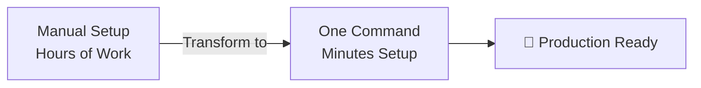
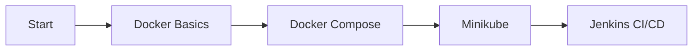
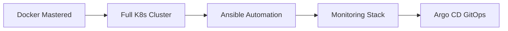
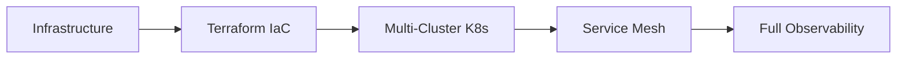

# 🛠️ DevOps Automation Scripts

<div align="center">


[](https://github.com/sujalkamanna/scripts/blob/main/LICENSE)
[](https://github.com/sujalkamanna/scripts)
[](https://github.com/sujalkamanna/scripts/issues)
[](https://github.com/sujalkamanna/scripts/commits/main)

### 🚀 Complete DevOps Toolkit with One-Click Installation Scripts

**Automate your entire infrastructure setup in minutes, not hours**

[Quick Start](#-quick-start) • [Tools](#-tools-included) • [Scripts](#-automation-scripts) • [Documentation](#-documentation)

</div>

---

## 🎯 What's This?

A **production-ready collection** of automation scripts and guides for setting up complete DevOps infrastructure on Ubuntu. From CI/CD pipelines to Kubernetes clusters, everything automated with a single command.

### ⚡ Why Use This?



---

## ✨ Features

<table>
<tr>
<td width="50%">

### 🎨 **Complete Automation**
- ✅ One-command installations
- ✅ Pre-configured setups
- ✅ Error handling built-in
- ✅ Idempotent scripts

</td>
<td width="50%">

### 🔒 **Production Ready**
- ✅ Security best practices
- ✅ Optimized configurations
- ✅ Ubuntu 24.04 tested
- ✅ Regular updates

</td>
</tr>
<tr>
<td width="50%">

### 🌍 **Full Stack Coverage**
- ✅ Container orchestration
- ✅ CI/CD pipelines
- ✅ Infrastructure as Code
- ✅ Monitoring & quality

</td>
<td width="50%">

### 📚 **Comprehensive Docs**
- ✅ Step-by-step guides
- ✅ Best practices
- ✅ Troubleshooting
- ✅ Real examples

</td>
</tr>
</table>

---

## 🧰 Tools Included

<div align="center">

| Category | Tools | Scripts |
|----------|-------|---------|
| **☸️ Orchestration** | Kubernetes • Minikube • Docker Swarm | `k8-*.sh` • `minikube.sh` |
| **🐳 Containers** | Docker • Docker Compose | `docker.sh` • `docker-compose.sh` |
| **🔄 CI/CD** | Jenkins • Argo CD | `jenkins.sh` • `argocd.md` |
| **📦 Config Mgmt** | Ansible | `ansible_*.sh` |
| **🏗️ IaC** | Terraform • AWS CLI | `terraform.md` • `aws-cli.md` |
| **📊 Monitoring** | Prometheus • Grafana • SonarQube | `prometheus.md` • `sonarqube.sh` |
| **🚀 Servers** | Tomcat 11 | `tomcat.sh` |

</div>

---

## 📂 Repository Structure

```
📦 scripts/
│
├── 🐳 Container & Orchestration
│   ├── docker.sh                    # Docker installation
│   ├── docker.md                    # Docker guide
│   ├── docker-compose.sh            # Compose setup
│   ├── docker-swarm.md              # Swarm clustering
│   ├── k8-common-script.sh          # K8s common setup
│   ├── k8-master-script.sh          # K8s master node
│   ├── k8-slave-script.sh           # K8s worker nodes
│   ├── k8-README.md                 # K8s complete guide
│   ├── minikube.sh                  # Local K8s
│   └── kops.md                      # K8s on AWS
│
├── 🔄 CI/CD & Automation
│   ├── jenkins.sh                   # Jenkins setup
│   ├── jenkins_pipeline/            # Pipeline examples
│   ├── argocd.md                    # Argo CD guide
│   └── self-hosted.md               # GitHub runners
│
├── 📦 Configuration Management
│   ├── ansible_master_script.sh     # Ansible master
│   ├── ansible_slave_scripts.sh     # Ansible nodes
│   └── ansible_configuration.md     # Ansible guide
│
├── 🏗️ Infrastructure as Code
│   ├── terraform.md                 # Terraform setup
│   └── aws-cli.md                   # AWS CLI guide
│
├── 📊 Monitoring & Quality
│   ├── prometheus.md                # Prometheus setup
│   ├── grafana.md                   # Grafana dashboards
│   └── sonarqube.sh                 # Code quality
│
├── 🚀 Application Servers
│   └── tomcat.sh                    # Tomcat 11
│
├── 📄 Documentation
│   ├── README.md                    # This file
│   ├── LICENSE                      # MIT License
│   ├── third_party_licenses.md      # Third-party licenses
│   └── others.md                    # Misc tools
```
---
<div align="center">

## 🎯 Quick Access

[](https://github.com/sujalkamanna/scripts/tree/main)
[](https://github.com/sujalkamanna/scripts/blob/main/tools.md)
[](./docs/)

</div>

---

## 🗂️ Repository Structure

<table>
<tr>
<td align="center" width="33%">

### 📂 Scripts

Automation scripts for common DevOps tasks

[](https://github.com/sujalkamanna/scripts/tree/main)

</td>
<td align="center" width="33%">

### 🔧 Tools Guide

Comprehensive DevOps tools reference

[](https://github.com/sujalkamanna/scripts/blob/main/tools.md)

**⭐ 500+ Tools**

</td>
<td align="center" width="33%">

### 📚 Documentation

Guides and tutorials

[](./docs/)

</td>
</tr>
</table>

---

## 📚 DevOps Tools Reference

Looking for the right tool for your DevOps workflow? Check out our comprehensive tools guide!

<div align="center">

### 🚀 [DevOps Tools Ecosystem Guide](https://github.com/sujalkamanna/scripts/blob/main/tools.md)

**500+ Tools** | **All Categories** | **Licensing Info** | **Official Links**

[](https://github.com/sujalkamanna/scripts/blob/main/tools.md)

</div>

---

### 🌟 What's Inside the Tools Guide

<table>
<tr>
<td width="50%" valign="top">

**📋 Categories Covered:**

- 🐧 Operating Systems & Linux Distributions
- 📝 Version Control Systems (Git, GitHub, GitLab, etc.)
- 🔄 CI/CD Tools (Jenkins, GitHub Actions, GitLab CI, etc.)
- 🐳 Containerization & Orchestration (Docker, Kubernetes, etc.)
- 🏗️ Infrastructure as Code (Terraform, Pulumi, Ansible, etc.)
- ☁️ Cloud Platforms (AWS, Azure, GCP, etc.)
- 📊 Monitoring & Observability (Prometheus, Grafana, etc.)
- 🔒 Security & DevSecOps (Trivy, Docker Scout, SonarQube, etc.)
- 🔀 GitOps, MLOps, AIOps, and much more!

</td>
<td width="50%" valign="top">

**✨ Key Features:**

| Feature | Details |
|---------|---------|
| **Total Tools** | 500+ tools across 25+ categories |
| **Licensing** | Free, Open Source, Freemium, Paid |
| **Links** | Official websites and documentation |
| **Comparisons** | Tool alternatives and comparisons |
| **Toolchains** | Real-world implementation examples |

<br/>

**Perfect for:**
- 🎯 Finding the right tool for your needs
- 📊 Comparing alternatives
- 💰 Understanding licensing options
- 🔗 Quick access to official documentation

</td>
</tr>
</table>

> **💡 All tools include licensing information (Free/Open Source/Freemium/Paid) and official links**

<div align="center">

### **[📖 Explore Complete Tools Guide →](https://github.com/sujalkamanna/scripts/blob/main/tools.md)**

</div>

---

<div align="center">

### ✨ Key Improvements

</div>

**This combined version provides:**

✅ **Better flow** - Quick Access → Repository Structure → Detailed Tools Guide  
✅ **No duplication** - Removed redundant badges  
✅ **Cleaner layout** - Two-column table for better organization  
✅ **Consistent styling** - Unified badge styles  
✅ **Better hierarchy** - Clear sections with proper headings  
✅ **Visual balance** - Even distribution of content  
✅ **Call-to-action** - Clear link to the tools guide at the end  

<div align="center">

*A professional, comprehensive overview while maintaining readability!* 🎯

</div>

---

## 🚀 Quick Start

### Prerequisites

```bash
✅ Ubuntu 24.04 (or compatible)
✅ Sudo/root access
✅ Internet connection
✅ 2+ CPU cores, 4GB+ RAM
```

### 🎯 One-Click Installations

<details open>
<summary><b>🐳 Docker Setup (Most Popular)</b></summary>

```bash
# Clone repository
git clone https://github.com/sujalkamanna/scripts.git
cd scripts

# Install Docker
chmod +x docker.sh
./docker.sh

# Verify
docker --version
docker run hello-world

# Install Docker Compose
chmod +x docker-compose.sh
./docker-compose.sh
```

**What you get:**
- ✅ Docker Engine latest version
- ✅ Docker Compose V2
- ✅ User added to docker group
- ✅ Service auto-start enabled

📖 [Full Docker Guide](docker.md) | 📖 [Docker Swarm](docker-swarm.md)

</details>

<details>
<summary><b>☸️ Kubernetes Cluster Setup</b></summary>

**Complete 3-Node Cluster:**

```bash
# On ALL nodes (master + workers)
chmod +x k8-common-script.sh
./k8-common-script.sh

# On MASTER node only
chmod +x k8-master-script.sh
./k8-master-script.sh
# Copy the 'kubeadm join' command shown

# On WORKER nodes
chmod +x k8-slave-script.sh
./k8-slave-script.sh
# Paste the join command when prompted
```

**Quick Local K8s:**

```bash
chmod +x minikube.sh
./minikube.sh
```

**What you get:**
- ✅ Full Kubernetes cluster
- ✅ Container runtime configured
- ✅ CNI networking ready
- ✅ kubectl configured
- ✅ Dashboard installed

📖 [Complete K8s Guide](k8-README.md) | 📖 [kOps on AWS](kops.md)

</details>

<details>
<summary><b>🔨 Jenkins CI/CD</b></summary>

```bash
chmod +x jenkins.sh
./jenkins.sh

# Access Jenkins
echo "Jenkins URL: http://$(hostname -I | awk '{print $1}'):8080"

# Get initial password
sudo cat /var/lib/jenkins/secrets/initialAdminPassword
```

**What you get:**
- ✅ Jenkins LTS installed
- ✅ Java 17 configured
- ✅ Service running on port 8080
- ✅ Ready for plugin installation

📖 [Pipeline Examples](jenkins_pipeline/)

</details>

<details>
<summary><b>🔄 Argo CD GitOps</b></summary>

```bash
# Follow comprehensive guide
cat argocd.md

# Quick install
kubectl create namespace argocd
kubectl apply -n argocd -f https://raw.githubusercontent.com/argoproj/argo-cd/stable/manifests/install.yaml
```

📖 [Full Argo CD Setup](argocd.md)

</details>

<details>
<summary><b>📦 Ansible Automation</b></summary>

**Master Node:**
```bash
chmod +x ansible_master_script.sh
./ansible_master_script.sh
```

**Slave Nodes:**
```bash
chmod +x ansible_slave_scripts.sh
./ansible_slave_scripts.sh
```

**What you get:**
- ✅ Ansible latest version
- ✅ SSH keys configured
- ✅ Inventory ready
- ✅ Ad-hoc commands enabled

📖 [Ansible Configuration](ansible_configuration.md)

</details>

<details>
<summary><b>🏗️ Terraform & AWS</b></summary>

```bash
# Terraform setup
cat terraform.md

# AWS CLI setup
cat aws-cli.md
```

📖 [Terraform Guide](terraform.md) | 📖 [AWS CLI](aws-cli.md)

</details>

<details>
<summary><b>📊 Monitoring Stack</b></summary>

**SonarQube:**
```bash
chmod +x sonarqube.sh
./sonarqube.sh

# Access: http://your-ip:9000
# Default: admin/admin
```

**Prometheus & Grafana:**
```bash
cat prometheus.md
cat grafana.md
```

📖 [Prometheus](prometheus.md) | 📖 [Grafana](grafana.md)

</details>

<details>
<summary><b>🚀 Tomcat Server</b></summary>

```bash
chmod +x tomcat.sh
./tomcat.sh

# Access: http://your-ip:8080
```

**What you get:**
- ✅ Tomcat 11 installed
- ✅ Java 17 configured
- ✅ Systemd service enabled
- ✅ Manager app ready

</details>

---

## 🎬 Demo Workflows

### Scenario 1: Full DevOps Environment

```bash
# 1. Install container runtime
./docker.sh

# 2. Setup K8s cluster
./k8-common-script.sh
./k8-master-script.sh  # on master
./k8-slave-script.sh   # on workers

# 3. Setup CI/CD
./jenkins.sh
# Follow argocd.md

# 4. Configure automation
./ansible_master_script.sh

# 5. Add monitoring
./sonarqube.sh
# Setup Prometheus/Grafana
```

### Scenario 2: Local Development

```bash
./docker.sh
./docker-compose.sh
./minikube.sh
```

### Scenario 3: Production Cluster

```bash
# Infrastructure
./k8-common-script.sh
./k8-master-script.sh  # 3 masters for HA
./k8-slave-script.sh   # N workers

# GitOps
# Setup Argo CD from argocd.md

# Monitoring
# Setup full stack from guides
```

---

## 📖 Complete Tool Matrix

| Tool | Installation | Documentation | Post-Install | Status |
|------|-------------|---------------|--------------|--------|
| **Docker** | `docker.sh` | [docker.md](docker.md) | Auto-configured | ✅ |
| **Docker Compose** | `docker-compose.sh` | Built-in | Auto-configured | ✅ |
| **Docker Swarm** | Manual | [docker-swarm.md](docker-swarm.md) | Manual setup | ✅ |
| **Kubernetes** | `k8-*.sh` | [k8-README.md](k8-README.md) | Manual join | ✅ |
| **Minikube** | `minikube.sh` | Built-in | Auto-start | ✅ |
| **kOps** | Manual | [kops.md](kops.md) | AWS required | ✅ |
| **Jenkins** | `jenkins.sh` | [jenkins_pipeline/](jenkins_pipeline/) | Web setup | ✅ |
| **Argo CD** | Manual | [argocd.md](argocd.md) | K8s required | ✅ |
| **Ansible** | `ansible_*.sh` | [ansible_configuration.md](ansible_configuration.md) | SSH keys | ✅ |
| **Terraform** | Manual | [terraform.md](terraform.md) | Provider config | ✅ |
| **AWS CLI** | Manual | [aws-cli.md](aws-cli.md) | Credentials | ✅ |
| **Prometheus** | Manual | [prometheus.md](prometheus.md) | Config files | ✅ |
| **Grafana** | Manual | [grafana.md](grafana.md) | Dashboards | ✅ |
| **SonarQube** | `sonarqube.sh` | Built-in | Web setup | ✅ |
| **Tomcat** | `tomcat.sh` | Built-in | Manager config | ✅ |
| **Self-Hosted** | Manual | [self-hosted.md](self-hosted.md) | GitHub token | ✅ |

---

## 🎓 Learning Path

### Beginner Track



**Steps:**
1. Install Docker → `docker.sh`
2. Learn Docker Compose → `docker-compose.sh`
3. Try Minikube → `minikube.sh`
4. Setup Jenkins → `jenkins.sh`

### Intermediate Track



**Steps:**
1. Production K8s → `k8-*.sh`
2. Automate with Ansible → `ansible_*.sh`
3. Add monitoring → Prometheus/Grafana
4. GitOps with Argo CD → `argocd.md`

### Advanced Track



**Steps:**
1. Terraform automation → `terraform.md`
2. kOps on AWS → `kops.md`
3. Advanced K8s patterns
4. Complete monitoring stack

---

## 🛡️ Security Best Practices

### 🔒 Script Security

```bash
# Always review before executing
cat script.sh

# Check file integrity
sha256sum script.sh

# Run with explicit bash
bash script.sh
```

### 🔐 Post-Installation Security

**Change Default Credentials:**
- Jenkins: Change admin password immediately
- SonarQube: admin/admin → strong password
- Grafana: admin/admin → strong password
- Tomcat: Configure manager users

**Enable Firewalls:**
```bash
# Ubuntu
sudo ufw allow 22/tcp
sudo ufw allow 80/tcp
sudo ufw allow 443/tcp
sudo ufw enable

# Application-specific ports as needed
```

**SSL/TLS:**
- Use Let's Encrypt for production
- Enable HTTPS for all web UIs
- Configure TLS in Kubernetes

**Secrets Management:**
- Use Kubernetes Secrets
- Consider Vault for production
- Never commit credentials to Git

---

## 🧪 Tested Environments

| OS | Version | Status | Notes |
|----|---------|--------|-------|
| Ubuntu | 24.04 LTS | ✅ Primary | Recommended |
| Ubuntu | 22.04 LTS | ✅ Tested | Fully supported |
| Ubuntu | 20.04 LTS | ⚠️ Legacy | Minor adjustments |
| Debian | 12 | ✅ Compatible | Most scripts work |
| CentOS | 8 Stream | ⚠️ Partial | RHEL-based adjustments needed |

---

## 🐛 Troubleshooting

<details>
<summary><b>Script Permission Denied</b></summary>

```bash
# Make executable
chmod +x script.sh

# Or run directly
bash script.sh
```

</details>

<details>
<summary><b>Docker: Permission Denied</b></summary>

```bash
# Add user to docker group
sudo usermod -aG docker $USER

# Logout and login, or
newgrp docker

# Verify
docker ps
```

</details>

<details>
<summary><b>Kubernetes: Nodes Not Joining</b></summary>

```bash
# On master, get join command
kubeadm token create --print-join-command

# On worker, ensure common script ran
# Then paste join command with sudo
```

</details>

<details>
<summary><b>Jenkins: Can't Access UI</b></summary>

```bash
# Check service
sudo systemctl status jenkins

# Check firewall
sudo ufw status
sudo ufw allow 8080/tcp

# Check initial password
sudo cat /var/lib/jenkins/secrets/initialAdminPassword
```

</details>

<details>
<summary><b>Service Won't Start</b></summary>

```bash
# Check logs
sudo journalctl -u service-name -f

# Check status
sudo systemctl status service-name

# Restart
sudo systemctl restart service-name
```

</details>

---

## 🤝 Contributing

We welcome contributions! 🎉

### How to Contribute

1. **Fork** the repository
2. **Create** feature branch: `git checkout -b feature/new-script`
3. **Add** your script with documentation
4. **Test** on fresh Ubuntu 24.04
5. **Commit**: `git commit -m 'Add new tool script'`
6. **Push**: `git push origin feature/new-script`
7. **Open** Pull Request

### Contribution Guidelines

**Scripts:**
- ✅ Include error handling
- ✅ Add comments explaining steps
- ✅ Test on clean Ubuntu install
- ✅ Make idempotent (safe to run multiple times)

**Documentation:**
- ✅ Clear setup instructions
- ✅ Prerequisites listed
- ✅ Post-install steps
- ✅ Troubleshooting section

**Code Style:**
- ✅ Use shellcheck for bash scripts
- ✅ Follow existing formatting
- ✅ Add meaningful commit messages

---

## 📜 License

### Repository License

This repository and its original content are licensed under the **MIT License**.

```
MIT License

Copyright (c) 2024 Sujal Kamanna

Permission is hereby granted, free of charge, to any person obtaining a copy
of this software and associated documentation files...
```

📄 [Full License](LICENSE)

### Third-Party Licenses

The scripts in this repository install third-party open-source software. Each tool retains its original license:

- **Docker**: Apache 2.0
- **Kubernetes**: Apache 2.0
- **Jenkins**: MIT
- **Ansible**: GPL v3
- **Terraform**: MPL 2.0
- **And more...**

📄 [Third-Party Licenses](https://github.com/sujalkamanna/scripts/blob/main/third_party_licenses.md)

---

## 🙏 Acknowledgments

<div align="center">

**Special thanks to:**

🐳 **Docker, Inc.** • ☸️ **Cloud Native Computing Foundation** • 🔨 **Jenkins Community**  
📦 **Ansible Project** • 🏗️ **HashiCorp** • 📊 **Prometheus & Grafana Labs**

**And the entire Open Source Community** for making these amazing tools available!

</div>

---

## 📞 Support & Community

### 💬 Get Help

- 🐛 **Report Issues**: [GitHub Issues](https://github.com/sujalkamanna/scripts/issues)
- 💡 **Request Features**: [GitHub Discussions](https://github.com/sujalkamanna/scripts/discussions)
- 📧 **Email**: sujalkamanna2003@gmail.com
- 💼 **LinkedIn**: [Your Profile](https://linkedin.com/in/yourprofile)

### 📚 Additional Resources

| Resource | Link | Description |
|----------|------|-------------|
| Docker Docs | [docs.docker.com](https://docs.docker.com) | Official Docker documentation |
| Kubernetes Docs | [kubernetes.io/docs](https://kubernetes.io/docs) | K8s official docs |
| Jenkins Docs | [jenkins.io/doc](https://jenkins.io/doc) | Jenkins documentation |
| Ansible Docs | [docs.ansible.com](https://docs.ansible.com) | Ansible guides |
| Terraform Docs | [terraform.io/docs](https://terraform.io/docs) | Terraform documentation |

---

## 📊 Project Stats

<div align="center">


</div>

---

## 🗺️ Roadmap

### Completed ✅
- [x] Docker & Docker Compose automation
- [x] Full Kubernetes cluster setup
- [x] Jenkins CI/CD installation
- [x] Ansible configuration management
- [x] Monitoring tools (Prometheus, Grafana, SonarQube)
- [x] Argo CD GitOps guide
- [x] Terraform & AWS CLI guides

### In Progress 🚧
- [ ] Helm charts collection
- [ ] Istio service mesh setup
- [ ] Vault secrets management
- [ ] Complete ELK stack

### Planned 📋
- [ ] GitLab CI/CD setup
- [ ] Rancher installation
- [ ] Harbor registry setup
- [ ] Complete observability stack
- [ ] Multi-cloud scripts (AWS, GCP, Azure)
- [ ] Windows support (WSL2)

---

## 📈 Usage Statistics

<div align="center">

**Most Downloaded Scripts:**

| Rank | Script | Downloads |
|------|--------|-----------|
| 🥇 | docker.sh | Most Popular |
| 🥈 | k8-master-script.sh | Second |
| 🥉 | jenkins.sh | Third |

</div>

---

## 💡 Tips & Tricks

### Quick Commands Reference

```bash
# Make all scripts executable at once
chmod +x *.sh

# Check service status
systemctl status service-name

# View logs in real-time
journalctl -u service-name -f

# Test script without executing
bash -n script.sh

# Backup before running
cp script.sh script.sh.bak
```

### Pro Tips

💡 **Always review scripts** before running with root privileges  
💡 **Keep backups** of configuration files before modifications  
💡 **Document changes** you make to default configurations  
💡 **Use version control** for your custom modifications  
💡 **Test in VM** before production deployment

---

<div align="center">

### ⭐ Star this repository if it helps you!

**Made with ❤️ for the DevOps Community**

---

**[⬆ Back to Top](#%EF%B8%8F-devops-automation-scripts)**

</div>
