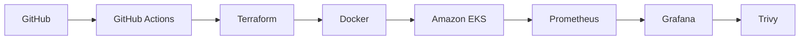
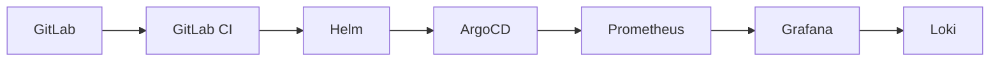
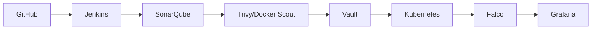
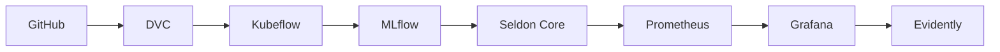
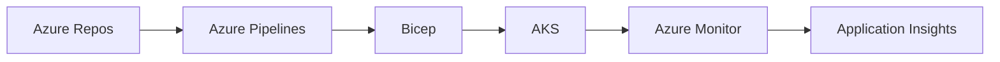
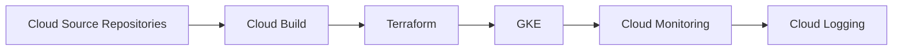
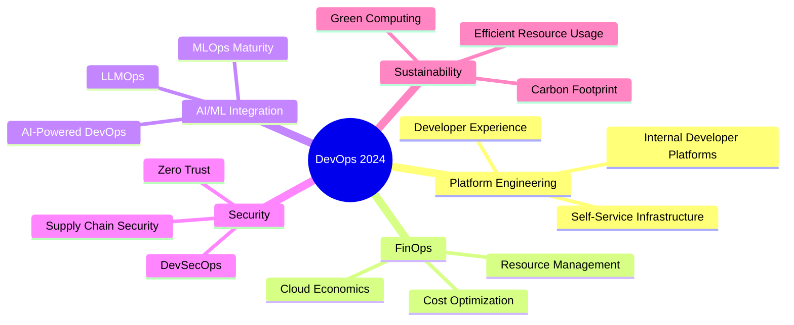

# 🚀 DevOps Tools Ecosystem - Complete Guide

<h3>
🔄 ⚙️ 🐳 ☸️ 🔧 📊 🔒
 
DevOps Tools Ecosystem
 
🚀 🌐 🛠️ 📈 🔍 💻 ⚡
</h3>

### 📚 A comprehensive collection of tools across **DevOps, DevSecOps, GitOps, MLOps, and AIOps**

---

## 🌟 Support This Project

If you find this guide helpful, please consider:

---

## 🎯 Quick Navigation

| [🐧 Operating Systems](#1-operating-systems-devops-foundations) | [📝 Version Control](#2-version-control-systems-vcs) | [🔄 CI/CD](#3-cicd-tools) | [📦 Build Tools](#4-build--artifact-management) |
|:---:|:---:|:---:|:---:|
| [⚙️ Config Mgmt](#5-configuration-management) | [🐳 Containers](#6-containerization) | [☸️ Orchestration](#7-container-orchestration) | [🏗️ IaC](#8-infrastructure-as-code-iac) |
| [☁️ Cloud](#9-cloud-platforms) | [📊 Monitoring](#10-monitoring--observability) | [🔒 Security](#11-security--devsecops) | [🌐 Networking](#12-networking--service-mesh) |
| [⏰ Automation](#13-automation--scheduling) | [🔀 GitOps](#14-gitops) | [🤖 MLOps](#15-mlops-machine-learning-operations) | [🧠 AIOps](#16-aiops-ai-for-it-operations) |

---

## 📊 Repository Stats

---

## 🎨 Technology Stack Coverage

---

## 💡 Features

✅ **500+ Tools** across all DevOps categories  
✅ **Licensing Information** - Free, Open Source, Freemium, Paid  
✅ **Official Links** to each tool's website  
✅ **Tool Comparisons** and alternatives  
✅ **Real-world Toolchains** for different scenarios  
✅ **Regular Updates** with latest tools  
✅ **Community Driven** - contributions welcome!

---

> **📢 Announcement:** This guide is actively maintained and updated regularly. Last update: **January 2026**

> **⚠️ Note:** Tools and their licensing models may change. Always verify on official websites before making decisions.

---

# 🚀 DevOps Tools Ecosystem - Complete Guide

> A comprehensive collection of tools across **DevOps, DevSecOps, GitOps, MLOps, and AIOps** with licensing information and official links.

---

## 📑 Table of Contents

- [Operating Systems](#1-operating-systems-devops-foundations)
- [Version Control Systems](#2-version-control-systems-vcs)
- [CI/CD Tools](#3-cicd-tools)
- [Build & Artifact Management](#4-build--artifact-management)
- [Configuration Management](#5-configuration-management)
- [Containerization](#6-containerization)
- [Container Orchestration](#7-container-orchestration)
- [Infrastructure as Code (IaC)](#8-infrastructure-as-code-iac)
- [Cloud Platforms](#9-cloud-platforms)
- [Monitoring & Observability](#10-monitoring--observability)
- [Security & DevSecOps](#11-security--devsecops)
- [Networking & Service Mesh](#12-networking--service-mesh)
- [Automation & Scheduling](#13-automation--scheduling)
- [GitOps](#14-gitops)
- [MLOps](#15-mlops-machine-learning-operations)
- [AIOps](#16-aiops-ai-for-it-operations)
- [Collaboration & Incident Management](#17-collaboration--incident-management)
- [Testing Tools](#18-testing-tools-devops-testing)
- [Cloud-Native Tooling](#19-cloud-native-tooling)
- [Backup & Disaster Recovery](#20-backup--disaster-recovery)
- [Database Management & Migration](#21-database-management--migration)
- [Service Management & ITSM](#22-service-management--itsm)
- [Code Quality & Analysis](#23-code-quality--analysis)
- [Popular Toolchains](#24-popular-devops-toolchains)

---

## 1. Operating Systems (DevOps Foundations)

### 🐧 Linux Distributions

| Tool | License | Official Link |
|------|---------|---------------|
| **Ubuntu** | Free/Open Source | [ubuntu.com](https://ubuntu.com/) |
| **Debian** | Free/Open Source | [debian.org](https://www.debian.org/) |
| **CentOS** | Free/Open Source (discontinued) | [centos.org](https://www.centos.org/) |
| **AlmaLinux** | Free/Open Source | [almalinux.org](https://almalinux.org/) |
| **Rocky Linux** | Free/Open Source | [rockylinux.org](https://rockylinux.org/) |
| **RHEL** | Paid | [redhat.com](https://www.redhat.com/en/technologies/linux-platforms/enterprise-linux) |
| **Amazon Linux** | Free (AWS optimized) | [aws.amazon.com/amazon-linux-2](https://aws.amazon.com/amazon-linux-2/) |
| **SUSE Linux Enterprise** | Paid | [suse.com](https://www.suse.com/) |
| **OpenSUSE** | Free/Open Source | [opensuse.org](https://www.opensuse.org/) |
| **Arch Linux** | Free/Open Source | [archlinux.org](https://archlinux.org/) |
| **Manjaro** | Free/Open Source | [manjaro.org](https://manjaro.org/) |
| **Fedora** | Free/Open Source | [fedoraproject.org](https://getfedora.org/) |

---

## 2. Version Control Systems (VCS)

| Tool | License | Official Link |
|------|---------|---------------|
| **Git** | Free/Open Source | [git-scm.com](https://git-scm.com/) |
| **GitHub** | Freemium | [github.com](https://github.com/) |
| **GitLab** | Freemium/Open Source | [gitlab.com](https://about.gitlab.com/) |
| **Bitbucket** | Freemium | [bitbucket.org](https://bitbucket.org/) |
| **Gitea** | Free/Open Source | [gitea.io](https://gitea.io/) |
| **Gogs** | Free/Open Source | [gogs.io](https://gogs.io/) |
| **Forgejo** | Free/Open Source | [forgejo.org](https://forgejo.org/) |
| **Azure Repos** | Freemium | [azure.microsoft.com/services/devops/repos](https://azure.microsoft.com/en-us/services/devops/repos/) |
| **Mercurial** | Free/Open Source | [mercurial-scm.org](https://www.mercurial-scm.org/) |
| **SVN (Subversion)** | Free/Open Source | [subversion.apache.org](https://subversion.apache.org/) |
| **Perforce** | Paid | [perforce.com](https://www.perforce.com/) |

---

## 3. CI/CD Tools

| Tool | License | Official Link |
|------|---------|---------------|
| **Jenkins** | Free/Open Source | [jenkins.io](https://www.jenkins.io/) |
| **GitHub Actions** | Freemium | [github.com/features/actions](https://github.com/features/actions) |
| **GitLab CI/CD** | Freemium/Open Source | [docs.gitlab.com/ee/ci](https://docs.gitlab.com/ee/ci/) |
| **CircleCI** | Freemium | [circleci.com](https://circleci.com/) |
| **Travis CI** | Freemium | [travis-ci.com](https://www.travis-ci.com/) |
| **Azure DevOps Pipelines** | Freemium | [azure.microsoft.com/services/devops/pipelines](https://azure.microsoft.com/en-us/services/devops/pipelines/) |
| **Bamboo** | Paid | [atlassian.com/software/bamboo](https://www.atlassian.com/software/bamboo) |
| **TeamCity** | Freemium | [jetbrains.com/teamcity](https://www.jetbrains.com/teamcity/) |
| **Drone CI** | Free/Open Source | [drone.io](https://www.drone.io/) |
| **Tekton** | Free/Open Source | [tekton.dev](https://tekton.dev/) |
| **Spinnaker** | Free/Open Source | [spinnaker.io](https://spinnaker.io/) |
| **Jenkins X** | Free/Open Source | [jenkins-x.io](https://jenkins-x.io/) |
| **AWS CodePipeline** | Paid (AWS) | [aws.amazon.com/codepipeline](https://aws.amazon.com/codepipeline/) |
| **AWS CodeBuild** | Paid (AWS) | [aws.amazon.com/codebuild](https://aws.amazon.com/codebuild/) |
| **AWS CodeDeploy** | Paid (AWS) | [aws.amazon.com/codedeploy](https://aws.amazon.com/codedeploy/) |
| **Google Cloud Build** | Paid (GCP) | [cloud.google.com/build](https://cloud.google.com/build) |
| **Argo Workflows** | Free/Open Source | [argoproj.github.io/workflows](https://argoproj.github.io/workflows/) |
| **Argo CD** | Free/Open Source | [argo-cd.readthedocs.io](https://argo-cd.readthedocs.io/) |
| **FluxCD** | Free/Open Source | [fluxcd.io](https://fluxcd.io/) |
| **Harness** | Paid | [harness.io](https://www.harness.io/) |
| **Codefresh** | Freemium | [codefresh.io](https://codefresh.io/) |
| **Buildkite** | Freemium | [buildkite.com](https://buildkite.com/) |
| **Semaphore CI** | Freemium | [semaphoreci.com](https://semaphoreci.com/) |
| **Buddy** | Freemium | [buddy.works](https://buddy.works/) |
| **GoCD** | Free/Open Source | [gocd.org](https://www.gocd.org/) |
| **Concourse CI** | Free/Open Source | [concourse-ci.org](https://concourse-ci.org/) |
| **Screwdriver** | Free/Open Source | [screwdriver.cd](https://screwdriver.cd/) |

---

## 4. Build & Artifact Management

| Tool | License | Official Link |
|------|---------|---------------|
| **Maven** | Free/Open Source | [maven.apache.org](https://maven.apache.org/) |
| **Gradle** | Free/Open Source | [gradle.org](https://gradle.org/) |
| **Ant** | Free/Open Source | [ant.apache.org](https://ant.apache.org/) |
| **npm** | Free/Open Source | [npmjs.com](https://www.npmjs.com/) |
| **Yarn** | Free/Open Source | [yarnpkg.com](https://yarnpkg.com/) |
| **pnpm** | Free/Open Source | [pnpm.io](https://pnpm.io/) |
| **pip** | Free/Open Source | [pypi.org](https://pypi.org/) |
| **NuGet** | Free/Open Source | [nuget.org](https://www.nuget.org/) |
| **Nexus Repository** | Freemium | [sonatype.com/products/nexus-repository](https://www.sonatype.com/products/nexus-repository) |
| **JFrog Artifactory** | Freemium | [jfrog.com/artifactory](https://jfrog.com/artifactory/) |
| **Docker Registry** | Free/Open Source | [docs.docker.com/registry](https://docs.docker.com/registry/) |
| **Harbor** | Free/Open Source | [goharbor.io](https://goharbor.io/) |
| **Azure Artifacts** | Freemium | [azure.microsoft.com/services/devops/artifacts](https://azure.microsoft.com/en-us/services/devops/artifacts/) |
| **AWS CodeArtifact** | Paid (AWS) | [aws.amazon.com/codeartifact](https://aws.amazon.com/codeartifact/) |
| **GitHub Packages** | Freemium | [github.com/features/packages](https://github.com/features/packages) |
| **GitLab Package Registry** | Freemium | [docs.gitlab.com/ee/user/packages](https://docs.gitlab.com/ee/user/packages/) |
| **Quay.io** | Freemium | [quay.io](https://quay.io/) |
| **ProGet** | Freemium | [inedo.com/proget](https://inedo.com/proget) |

---

## 5. Configuration Management

| Tool | License | Official Link |
|------|---------|---------------|
| **Ansible** | Free/Open Source | [ansible.com](https://www.ansible.com/) |
| **Puppet** | Freemium/Open Source | [puppet.com](https://puppet.com/) |
| **Chef** | Freemium/Open Source | [chef.io](https://www.chef.io/) |
| **SaltStack** | Free/Open Source | [saltproject.io](https://saltproject.io/) |
| **CFEngine** | Freemium/Open Source | [cfengine.com](https://cfengine.com/) |
| **Terraform** | Free/Open Source | [terraform.io](https://www.terraform.io/) |
| **AWS Systems Manager** | Paid (AWS) | [aws.amazon.com/systems-manager](https://aws.amazon.com/systems-manager/) |
| **Azure Automation** | Paid (Azure) | [azure.microsoft.com/services/automation](https://azure.microsoft.com/en-us/services/automation/) |

---

## 6. Containerization

| Tool | License | Official Link |
|------|---------|---------------|
| **Docker** | Free/Open Source | [docker.com](https://www.docker.com/) |
| **Docker Compose** | Free/Open Source | [docs.docker.com/compose](https://docs.docker.com/compose/) |
| **Podman** | Free/Open Source | [podman.io](https://podman.io/) |
| **containerd** | Free/Open Source | [containerd.io](https://containerd.io/) |
| **CRI-O** | Free/Open Source | [cri-o.io](https://cri-o.io/) |
| **LXC/LXD** | Free/Open Source | [linuxcontainers.org](https://linuxcontainers.org/) |
| **Buildah** | Free/Open Source | [buildah.io](https://buildah.io/) |
| **Kaniko** | Free/Open Source | [github.com/GoogleContainerTools/kaniko](https://github.com/GoogleContainerTools/kaniko) |
| **Skopeo** | Free/Open Source | [github.com/containers/skopeo](https://github.com/containers/skopeo) |
| **Buildx** | Free/Open Source | [docs.docker.com/buildx](https://docs.docker.com/buildx/working-with-buildx/) |
| **Cloud Native Buildpacks** | Free/Open Source | [buildpacks.io](https://buildpacks.io/) |
| **img** | Free/Open Source | [github.com/genuinetools/img](https://github.com/genuinetools/img) |

---

## 7. Container Orchestration

| Tool | License | Official Link |
|------|---------|---------------|
| **Kubernetes (K8s)** | Free/Open Source | [kubernetes.io](https://kubernetes.io/) |
| **OpenShift** | Freemium (Red Hat) | [openshift.com](https://www.openshift.com/) |
| **Amazon EKS** | Paid (AWS) | [aws.amazon.com/eks](https://aws.amazon.com/eks/) |
| **Google GKE** | Paid (GCP) | [cloud.google.com/kubernetes-engine](https://cloud.google.com/kubernetes-engine) |
| **Azure AKS** | Paid (Azure) | [azure.microsoft.com/services/kubernetes-service](https://azure.microsoft.com/en-us/services/kubernetes-service/) |
| **Nomad** | Free/Open Source | [nomadproject.io](https://www.nomadproject.io/) |
| **Docker Swarm** | Free/Open Source | [docs.docker.com/engine/swarm](https://docs.docker.com/engine/swarm/) |
| **Rancher** | Free/Open Source | [rancher.com](https://rancher.com/) |
| **K3s** | Free/Open Source | [k3s.io](https://k3s.io/) |
| **MicroK8s** | Free/Open Source | [microk8s.io](https://microk8s.io/) |
| **K0s** | Free/Open Source | [k0sproject.io](https://k0sproject.io/) |
| **Kind** | Free/Open Source | [kind.sigs.k8s.io](https://kind.sigs.k8s.io/) |
| **Minikube** | Free/Open Source | [minikube.sigs.k8s.io](https://minikube.sigs.k8s.io/) |
| **Amazon ECS** | Paid (AWS) | [aws.amazon.com/ecs](https://aws.amazon.com/ecs/) |
| **AWS Fargate** | Paid (AWS) | [aws.amazon.com/fargate](https://aws.amazon.com/fargate/) |
| **Azure Container Instances** | Paid (Azure) | [azure.microsoft.com/services/container-instances](https://azure.microsoft.com/en-us/services/container-instances/) |
| **Google Cloud Run** | Paid (GCP) | [cloud.google.com/run](https://cloud.google.com/run) |
| **Apache Mesos** | Free/Open Source | [mesos.apache.org](https://mesos.apache.org/) |

---

## 8. Infrastructure as Code (IaC)

| Tool | License | Official Link |
|------|---------|---------------|
| **Terraform** | Free/Open Source | [terraform.io](https://www.terraform.io/) |
| **Terraform Cloud** | Freemium | [cloud.hashicorp.com/products/terraform](https://cloud.hashicorp.com/products/terraform) |
| **AWS CloudFormation** | Free (AWS) | [aws.amazon.com/cloudformation](https://aws.amazon.com/cloudformation/) |
| **Pulumi** | Freemium/Open Source | [pulumi.com](https://www.pulumi.com/) |
| **ARM Templates** | Free (Azure) | [docs.microsoft.com/azure/azure-resource-manager/templates](https://docs.microsoft.com/en-us/azure/azure-resource-manager/templates/) |
| **Bicep** | Free/Open Source | [docs.microsoft.com/azure/azure-resource-manager/bicep](https://docs.microsoft.com/en-us/azure/azure-resource-manager/bicep/) |
| **AWS CDK** | Free/Open Source | [aws.amazon.com/cdk](https://aws.amazon.com/cdk/) |
| **Crossplane** | Free/Open Source | [crossplane.io](https://www.crossplane.io/) |
| **Terragrunt** | Free/Open Source | [terragrunt.gruntwork.io](https://terragrunt.gruntwork.io/) |
| **Ansible** | Free/Open Source | [ansible.com](https://www.ansible.com/) |
| **Chef** | Freemium/Open Source | [chef.io](https://www.chef.io/) |
| **Azure Resource Manager** | Free (Azure) | [azure.microsoft.com/features/resource-manager](https://azure.microsoft.com/en-us/features/resource-manager/) |
| **Google Cloud Deployment Manager** | Free (GCP) | [cloud.google.com/deployment-manager](https://cloud.google.com/deployment-manager) |
| **CDKTF** | Free/Open Source | [github.com/hashicorp/terraform-cdk](https://github.com/hashicorp/terraform-cdk) |

---

## 9. Cloud Platforms

### ☁️ Public Cloud

| Tool | License | Official Link |
|------|---------|---------------|
| **AWS** | Paid | [aws.amazon.com](https://aws.amazon.com/) |
| **Microsoft Azure** | Paid | [azure.microsoft.com](https://azure.microsoft.com/) |
| **Google Cloud Platform** | Paid | [cloud.google.com](https://cloud.google.com/) |
| **Oracle Cloud** | Paid | [oracle.com/cloud](https://www.oracle.com/cloud/) |
| **IBM Cloud** | Paid | [ibm.com/cloud](https://www.ibm.com/cloud) |
| **Alibaba Cloud** | Paid | [alibabacloud.com](https://www.alibabacloud.com/) |
| **DigitalOcean** | Paid | [digitalocean.com](https://www.digitalocean.com/) |
| **Linode (Akamai)** | Paid | [linode.com](https://www.linode.com/) |
| **Vultr** | Paid | [vultr.com](https://www.vultr.com/) |
| **Hetzner Cloud** | Paid | [hetzner.com/cloud](https://www.hetzner.com/cloud) |
| **Scaleway** | Paid | [scaleway.com](https://www.scaleway.com/) |

### 🏢 Private / Hybrid Cloud

| Tool | License | Official Link |
|------|---------|---------------|
| **OpenStack** | Free/Open Source | [openstack.org](https://www.openstack.org/) |
| **VMware vSphere** | Paid | [vmware.com/products/vsphere](https://www.vmware.com/products/vsphere.html) |
| **Proxmox** | Free/Open Source | [proxmox.com](https://www.proxmox.com/) |
| **Apache CloudStack** | Free/Open Source | [cloudstack.apache.org](https://cloudstack.apache.org/) |
| **Eucalyptus** | Free/Open Source | [eucalyptus.cloud](https://www.eucalyptus.cloud/) |
| **oVirt** | Free/Open Source | [ovirt.org](https://www.ovirt.org/) |

---

## 10. Monitoring & Observability

### 📊 Monitoring

| Tool | License | Official Link |
|------|---------|---------------|
| **Prometheus** | Free/Open Source | [prometheus.io](https://prometheus.io/) |
| **Grafana** | Free/Open Source | [grafana.com](https://grafana.com/) |
| **Datadog** | Paid | [datadoghq.com](https://www.datadoghq.com/) |
| **New Relic** | Paid | [newrelic.com](https://newrelic.com/) |
| **Zabbix** | Free/Open Source | [zabbix.com](https://www.zabbix.com/) |
| **Nagios** | Free/Open Source | [nagios.org](https://www.nagios.org/) |
| **Nagios XI** | Paid | [nagios.com/products/nagios-xi](https://www.nagios.com/products/nagios-xi/) |
| **Icinga** | Free/Open Source | [icinga.com](https://icinga.com/) |
| **Dynatrace** | Paid | [dynatrace.com](https://www.dynatrace.com/) |
| **AppDynamics** | Paid | [appdynamics.com](https://www.appdynamics.com/) |
| **Netdata** | Free/Open Source | [netdata.cloud](https://www.netdata.cloud/) |
| **VictoriaMetrics** | Free/Open Source | [victoriametrics.com](https://victoriametrics.com/) |
| **Thanos** | Free/Open Source | [thanos.io](https://thanos.io/) |
| **Cortex** | Free/Open Source | [cortexmetrics.io](https://cortexmetrics.io/) |
| **Sensu** | Freemium/Open Source | [sensu.io](https://sensu.io/) |
| **Checkmk** | Freemium/Open Source | [checkmk.com](https://checkmk.com/) |

### 📝 Logging

| Tool | License | Official Link |
|------|---------|---------------|
| **Elasticsearch** | Freemium/Open Source | [elastic.co/elasticsearch](https://www.elastic.co/elasticsearch/) |
| **Logstash** | Free/Open Source | [elastic.co/logstash](https://www.elastic.co/logstash/) |
| **Kibana** | Freemium/Open Source | [elastic.co/kibana](https://www.elastic.co/kibana/) |
| **Loki** | Free/Open Source | [grafana.com/oss/loki](https://grafana.com/oss/loki/) |
| **Fluentd** | Free/Open Source | [fluentd.org](https://www.fluentd.org/) |
| **Fluent Bit** | Free/Open Source | [fluentbit.io](https://fluentbit.io/) |
| **Graylog** | Freemium/Open Source | [graylog.org](https://www.graylog.org/) |
| **Splunk** | Paid | [splunk.com](https://www.splunk.com/) |
| **AWS CloudWatch Logs** | Paid (AWS) | [aws.amazon.com/cloudwatch](https://aws.amazon.com/cloudwatch/) |
| **Azure Monitor Logs** | Paid (Azure) | [azure.microsoft.com/services/monitor](https://azure.microsoft.com/en-us/services/monitor/) |
| **Google Cloud Logging** | Paid (GCP) | [cloud.google.com/logging](https://cloud.google.com/logging) |
| **Papertrail** | Freemium | [papertrail.com](https://www.papertrail.com/) |
| **Loggly** | Paid | [loggly.com](https://www.loggly.com/) |
| **Sumo Logic** | Paid | [sumologic.com](https://www.sumologic.com/) |

### 🔍 Tracing

| Tool | License | Official Link |
|------|---------|---------------|
| **Jaeger** | Free/Open Source | [jaegertracing.io](https://www.jaegertracing.io/) |
| **Zipkin** | Free/Open Source | [zipkin.io](https://zipkin.io/) |
| **OpenTelemetry** | Free/Open Source | [opentelemetry.io](https://opentelemetry.io/) |
| **Grafana Tempo** | Free/Open Source | [grafana.com/oss/tempo](https://grafana.com/oss/tempo/) |
| **AWS X-Ray** | Paid (AWS) | [aws.amazon.com/xray](https://aws.amazon.com/xray/) |
| **Datadog APM** | Paid | [datadoghq.com/product/apm](https://www.datadoghq.com/product/apm/) |
| **New Relic APM** | Paid | [newrelic.com/products/application-monitoring](https://newrelic.com/products/application-monitoring) |
| **Elastic APM** | Freemium/Open Source | [elastic.co/apm](https://www.elastic.co/apm/) |
| **SigNoz** | Free/Open Source | [signoz.io](https://signoz.io/) |
| **Honeycomb** | Paid | [honeycomb.io](https://www.honeycomb.io/) |
| **Lightstep** | Paid | [lightstep.com](https://lightstep.com/) |

### 🎯 Application Performance Monitoring (APM)

| Tool | License | Official Link |
|------|---------|---------------|
| **Elastic APM** | Freemium/Open Source | [elastic.co/apm](https://www.elastic.co/apm/) |
| **Sentry** | Freemium/Open Source | [sentry.io](https://sentry.io/) |
| **Rollbar** | Freemium | [rollbar.com](https://rollbar.com/) |
| **Instana** | Paid | [instana.com](https://www.instana.com/) |
| **AppDynamics** | Paid | [appdynamics.com](https://www.appdynamics.com/) |
| **New Relic APM** | Paid | [newrelic.com](https://newrelic.com/) |
| **Datadog APM** | Paid | [datadoghq.com](https://www.datadoghq.com/) |
| **Dynatrace** | Paid | [dynatrace.com](https://www.dynatrace.com/) |

---

## 11. Security & DevSecOps

### 🔒 SAST (Static Application Security Testing)

| Tool | License | Official Link |
|------|---------|---------------|
| **SonarQube** | Freemium/Open Source | [sonarqube.org](https://www.sonarqube.org/) |
| **SonarCloud** | Freemium | [sonarcloud.io](https://sonarcloud.io/) |
| **Checkmarx** | Paid | [checkmarx.com](https://www.checkmarx.com/) |
| **Veracode** | Paid | [veracode.com](https://www.veracode.com/) |
| **Semgrep** | Freemium/Open Source | [semgrep.dev](https://semgrep.dev/) |
| **Bandit** | Free/Open Source | [github.com/PyCQA/bandit](https://github.com/PyCQA/bandit) |
| **ESLint** | Free/Open Source | [eslint.org](https://eslint.org/) |
| **Brakeman** | Free/Open Source | [brakemanscanner.org](https://brakemanscanner.org/) |
| **CodeQL** | Free (GitHub) | [codeql.github.com](https://codeql.github.com/) |
| **Fortify** | Paid | [microfocus.com/en-us/cyberres/application-security/static-code-analyzer](https://www.microfocus.com/en-us/cyberres/application-security/static-code-analyzer) |
| **Coverity** | Paid | [synopsys.com/software-integrity/security-testing/static-analysis-sast](https://www.synopsys.com/software-integrity/security-testing/static-analysis-sast.html) |

### 🌐 DAST (Dynamic Application Security Testing)

| Tool | License | Official Link |
|------|---------|---------------|
| **OWASP ZAP** | Free/Open Source | [zaproxy.org](https://www.zaproxy.org/) |
| **Burp Suite** | Freemium | [portswigger.net/burp](https://portswigger.net/burp) |
| **Acunetix** | Paid | [acunetix.com](https://www.acunetix.com/) |
| **Netsparker** | Paid | [netsparker.com](https://www.netsparker.com/) |
| **AppScan** | Paid | [hcltechsw.com/appscan](https://www.hcltechsw.com/appscan) |

### 🐳 Container/Image Scanning

| Tool | License | Official Link |
|------|---------|---------------|
| **Trivy** | Free/Open Source | [aquasecurity.github.io/trivy](https://aquasecurity.github.io/trivy/) |
| **Docker Scout** | Freemium | [docs.docker.com/scout](https://docs.docker.com/scout/) |
| **Clair** | Free/Open Source | [github.com/quay/clair](https://github.com/quay/clair) |
| **Grype** | Free/Open Source | [github.com/anchore/grype](https://github.com/anchore/grype) |
| **Anchore** | Freemium/Open Source | [anchore.com](https://anchore.com/) |
| **Snyk Container** | Freemium | [snyk.io/product/container-vulnerability-management](https://snyk.io/product/container-vulnerability-management/) |
| **Aqua Security** | Paid | [aquasec.com](https://www.aquasec.com/) |
| **Sysdig Secure** | Paid | [sysdig.com/products/secure](https://sysdig.com/products/secure/) |
| **Twistlock (Prisma Cloud)** | Paid | [paloaltonetworks.com/prisma/cloud](https://www.paloaltonetworks.com/prisma/cloud) |
| **JFrog Xray** | Paid | [jfrog.com/xray](https://jfrog.com/xray/) |

### 📦 Dependency Scanning

| Tool | License | Official Link |
|------|---------|---------------|
| **Snyk** | Freemium | [snyk.io](https://snyk.io/) |
| **Dependabot** | Free (GitHub) | [github.com/dependabot](https://github.com/dependabot) |
| **OWASP Dependency-Check** | Free/Open Source | [owasp.org/www-project-dependency-check](https://owasp.org/www-project-dependency-check/) |
| **WhiteSource (Mend)** | Paid | [mend.io](https://www.mend.io/) |
| **Black Duck** | Paid | [synopsys.com/software-integrity/security-testing/software-composition-analysis](https://www.synopsys.com/software-integrity/security-testing/software-composition-analysis.html) |
| **Renovate** | Free/Open Source | [renovatebot.com](https://www.renovatebot.com/) |

### 🔐 Secrets Management

| Tool | License | Official Link |
|------|---------|---------------|
| **HashiCorp Vault** | Freemium/Open Source | [vaultproject.io](https://www.vaultproject.io/) |
| **AWS Secrets Manager** | Paid (AWS) | [aws.amazon.com/secrets-manager](https://aws.amazon.com/secrets-manager/) |
| **Azure Key Vault** | Paid (Azure) | [azure.microsoft.com/services/key-vault](https://azure.microsoft.com/en-us/services/key-vault/) |
| **Google Secret Manager** | Paid (GCP) | [cloud.google.com/secret-manager](https://cloud.google.com/secret-manager) |
| **SOPS** | Free/Open Source | [github.com/mozilla/sops](https://github.com/mozilla/sops) |
| **Sealed Secrets** | Free/Open Source | [github.com/bitnami-labs/sealed-secrets](https://github.com/bitnami-labs/sealed-secrets) |
| **Doppler** | Freemium | [doppler.com](https://www.doppler.com/) |
| **1Password Secrets Automation** | Paid | [1password.com/products/secrets](https://1password.com/products/secrets/) |
| **CyberArk** | Paid | [cyberark.com](https://www.cyberark.com/) |
| **Infisical** | Free/Open Source | [infisical.com](https://infisical.com/) |

### 📋 Compliance & Policy

| Tool | License | Official Link |
|------|---------|---------------|
| **Open Policy Agent (OPA)** | Free/Open Source | [openpolicyagent.org](https://www.openpolicyagent.org/) |
| **Kyverno** | Free/Open Source | [kyverno.io](https://kyverno.io/) |
| **Falco** | Free/Open Source | [falco.org](https://falco.org/) |
| **Checkov** | Free/Open Source | [checkov.io](https://www.checkov.io/) |
| **Terrascan** | Free/Open Source | [runterrascan.io](https://runterrascan.io/) |
| **tfsec** | Free/Open Source | [tfsec.dev](https://tfsec.dev/) |
| **Regula** | Free/Open Source | [regula.dev](https://regula.dev/) |
| **Cloud Custodian** | Free/Open Source | [cloudcustodian.io](https://cloudcustodian.io/) |
| **Prowler** | Free/Open Source | [prowler.pro](https://prowler.pro/) |
| **ScoutSuite** | Free/Open Source | [github.com/nccgroup/ScoutSuite](https://github.com/nccgroup/ScoutSuite) |

### 🛡️ Vulnerability Management

| Tool | License | Official Link |
|------|---------|---------------|
| **OpenVAS** | Free/Open Source | [openvas.org](https://www.openvas.org/) |
| **Nessus** | Paid | [tenable.com/products/nessus](https://www.tenable.com/products/nessus) |
| **Qualys** | Paid | [qualys.com](https://www.qualys.com/) |
| **Rapid7 InsightVM** | Paid | [rapid7.com/products/insightvm](https://www.rapid7.com/products/insightvm/) |
| **Tenable.io** | Paid | [tenable.com/products/tenable-io](https://www.tenable.com/products/tenable-io) |
| **Wazuh** | Free/Open Source | [wazuh.com](https://wazuh.com/) |

### 🚨 Runtime Security

| Tool | License | Official Link |
|------|---------|---------------|
| **Falco** | Free/Open Source | [falco.org](https://falco.org/) |
| **Aqua Security** | Paid | [aquasec.com](https://www.aquasec.com/) |
| **Sysdig Secure** | Paid | [sysdig.com/products/secure](https://sysdig.com/products/secure/) |
| **StackRox (Red Hat)** | Paid | [redhat.com/en/technologies/cloud-computing/openshift/advanced-cluster-security-kubernetes](https://www.redhat.com/en/technologies/cloud-computing/openshift/advanced-cluster-security-kubernetes) |
| **Tracee** | Free/Open Source | [aquasecurity.github.io/tracee](https://aquasecurity.github.io/tracee/) |

---

## 12. Networking & Service Mesh

### 🌐 Web Servers / Reverse Proxy

| Tool | License | Official Link |
|------|---------|---------------|
| **Nginx** | Free/Open Source | [nginx.org](https://nginx.org/) |
| **Apache HTTPD** | Free/Open Source | [httpd.apache.org](https://httpd.apache.org/) |
| **HAProxy** | Free/Open Source | [haproxy.org](https://www.haproxy.org/) |
| **Traefik** | Free/Open Source | [traefik.io](https://traefik.io/) |
| **Caddy** | Free/Open Source | [caddyserver.com](https://caddyserver.com/) |
| **Envoy** | Free/Open Source | [envoyproxy.io](https://www.envoyproxy.io/) |
| **Kong Gateway** | Freemium/Open Source | [konghq.com](https://konghq.com/) |
| **Nginx Plus** | Paid | [nginx.com/products/nginx](https://www.nginx.com/products/nginx/) |

### 🕸️ Service Mesh

| Tool | License | Official Link |
|------|---------|---------------|
| **Istio** | Free/Open Source | [istio.io](https://istio.io/) |
| **Linkerd** | Free/Open Source | [linkerd.io](https://linkerd.io/) |
| **Consul Connect** | Freemium/Open Source | [consul.io/docs/connect](https://www.consul.io/docs/connect) |
| **AWS App Mesh** | Free (AWS) | [aws.amazon.com/app-mesh](https://aws.amazon.com/app-mesh/) |
| **Kuma** | Free/Open Source | [kuma.io](https://kuma.io/) |
| **Open Service Mesh** | Free/Open Source | [openservicemesh.io](https://openservicemesh.io/) |
| **Cilium Service Mesh** | Free/Open Source | [cilium.io](https://cilium.io/) |

### 🔍 Service Discovery

| Tool | License | Official Link |
|------|---------|---------------|
| **Consul** | Freemium/Open Source | [consul.io](https://www.consul.io/) |
| **etcd** | Free/Open Source | [etcd.io](https://etcd.io/) |
| **ZooKeeper** | Free/Open Source | [zookeeper.apache.org](https://zookeeper.apache.org/) |
| **Eureka** | Free/Open Source | [github.com/Netflix/eureka](https://github.com/Netflix/eureka) |

### 🌍 DNS

| Tool | License | Official Link |
|------|---------|---------------|
| **CoreDNS** | Free/Open Source | [coredns.io](https://coredns.io/) |
| **Bind9** | Free/Open Source | [isc.org/bind](https://www.isc.org/bind/) |
| **dnsmasq** | Free/Open Source | [thekelleys.org.uk/dnsmasq](http://www.thekelleys.org.uk/dnsmasq/doc.html) |
| **PowerDNS** | Free/Open Source | [powerdns.com](https://www.powerdns.com/) |

### 🚪 API Gateway

| Tool | License | Official Link |
|------|---------|---------------|
| **Kong** | Freemium/Open Source | [konghq.com](https://konghq.com/) |
| **Tyk** | Freemium/Open Source | [tyk.io](https://tyk.io/) |
| **AWS API Gateway** | Paid (AWS) | [aws.amazon.com/api-gateway](https://aws.amazon.com/api-gateway/) |
| **Azure API Management** | Paid (Azure) | [azure.microsoft.com/services/api-management](https://azure.microsoft.com/en-us/services/api-management/) |
| **Apigee** | Paid (Google) | [cloud.google.com/apigee](https://cloud.google.com/apigee) |
| **Gravitee** | Freemium/Open Source | [gravitee.io](https://www.gravitee.io/) |
| **Express Gateway** | Free/Open Source | [express-gateway.io](https://www.express-gateway.io/) |

---

## 13. Automation & Scheduling

| Tool | License | Official Link |
|------|---------|---------------|
| **Cron** | Free/Open Source | Built-in Linux |
| **Systemd timers** | Free/Open Source | Built-in Linux |
| **Apache Airflow** | Free/Open Source | [airflow.apache.org](https://airflow.apache.org/) |
| **Prefect** | Freemium/Open Source | [prefect.io](https://www.prefect.io/) |
| **Dagster** | Free/Open Source | [dagster.io](https://dagster.io/) |
| **Rundeck** | Freemium/Open Source | [rundeck.com](https://www.rundeck.com/) |
| **n8n** | Freemium/Open Source | [n8n.io](https://n8n.io/) |
| **Argo Workflows** | Free/Open Source | [argoproj.github.io/workflows](https://argoproj.github.io/workflows/) |
| **Luigi** | Free/Open Source | [github.com/spotify/luigi](https://github.com/spotify/luigi) |
| **Celery** | Free/Open Source | [celeryproject.org](https://docs.celeryproject.org/) |
| **Temporal** | Free/Open Source | [temporal.io](https://temporal.io/) |
| **Cadence** | Free/Open Source | [cadenceworkflow.io](https://cadenceworkflow.io/) |

---

## 14. GitOps

| Tool | License | Official Link |
|------|---------|---------------|
| **ArgoCD** | Free/Open Source | [argo-cd.readthedocs.io](https://argo-cd.readthedocs.io/) |
| **FluxCD** | Free/Open Source | [fluxcd.io](https://fluxcd.io/) |
| **Jenkins X** | Free/Open Source | [jenkins-x.io](https://jenkins-x.io/) |
| **Rancher Fleet** | Free/Open Source | [fleet.rancher.io](https://fleet.rancher.io/) |
| **Weave GitOps** | Freemium/Open Source | [weave.works/product/gitops](https://www.weave.works/product/gitops/) |
| **Codefresh** | Freemium | [codefresh.io](https://codefresh.io/) |

---

## 15. MLOps (Machine Learning Operations)

### 🧪 Experiment Tracking

| Tool | License | Official Link |
|------|---------|---------------|
| **MLflow** | Free/Open Source | [mlflow.org](https://mlflow.org/) |
| **Weights & Biases (W&B)** | Freemium | [wandb.ai](https://wandb.ai/) |
| **Neptune.ai** | Freemium | [neptune.ai](https://neptune.ai/) |
| **Comet.ml** | Freemium | [comet.com](https://www.comet.com/) |
| **Guild AI** | Free/Open Source | [guild.ai](https://guild.ai/) |
| **Aim** | Free/Open Source | [aimstack.io](https://aimstack.io/) |
| **ClearML** | Freemium/Open Source | [clear.ml](https://clear.ml/) |

### 🚀 Model Serving

| Tool | License | Official Link |
|------|---------|---------------|
| **TensorFlow Serving** | Free/Open Source | [tensorflow.org/tfx/guide/serving](https://www.tensorflow.org/tfx/guide/serving) |
| **TorchServe** | Free/Open Source | [pytorch.org/serve](https://pytorch.org/serve/) |
| **Seldon Core** | Free/Open Source | [seldon.io](https://www.seldon.io/) |
| **KServe** | Free/Open Source | [kserve.github.io](https://kserve.github.io/) |
| **BentoML** | Free/Open Source | [bentoml.com](https://www.bentoml.com/) |
| **MLflow Models** | Free/Open Source | [mlflow.org/docs/latest/models](https://mlflow.org/docs/latest/models.html) |
| **NVIDIA Triton** | Free/Open Source | [github.com/triton-inference-server](https://github.com/triton-inference-server/server) |
| **Amazon SageMaker** | Paid (AWS) | [aws.amazon.com/sagemaker](https://aws.amazon.com/sagemaker/) |
| **Azure Machine Learning** | Paid (Azure) | [azure.microsoft.com/services/machine-learning](https://azure.microsoft.com/en-us/services/machine-learning/) |
| **Google Vertex AI** | Paid (GCP) | [cloud.google.com/vertex-ai](https://cloud.google.com/vertex-ai) |

### 🔄 ML Pipelines

| Tool | License | Official Link |
|------|---------|---------------|
| **Kubeflow** | Free/Open Source | [kubeflow.org](https://www.kubeflow.org/) |
| **Kubeflow Pipelines** | Free/Open Source | [kubeflow.org/docs/components/pipelines](https://www.kubeflow.org/docs/components/pipelines/) |
| **Metaflow** | Free/Open Source | [metaflow.org](https://metaflow.org/) |
| **Apache Airflow** | Free/Open Source | [airflow.apache.org](https://airflow.apache.org/) |
| **Argo Workflows** | Free/Open Source | [argoproj.github.io/workflows](https://argoproj.github.io/workflows/) |
| **ZenML** | Free/Open Source | [zenml.io](https://www.zenml.io/) |
| **Kedro** | Free/Open Source | [kedro.org](https://kedro.org/) |
| **Flyte** | Free/Open Source | [flyte.org](https://flyte.org/) |
| **ClearML Pipelines** | Freemium/Open Source | [clear.ml](https://clear.ml/) |

### 🗄️ Feature Stores

| Tool | License | Official Link |
|------|---------|---------------|
| **Feast** | Free/Open Source | [feast.dev](https://feast.dev/) |
| **Tecton** | Paid | [tecton.ai](https://www.tecton.ai/) |
| **Hopsworks** | Freemium/Open Source | [hopsworks.ai](https://www.hopsworks.ai/) |
| **AWS SageMaker Feature Store** | Paid (AWS) | [aws.amazon.com/sagemaker/feature-store](https://aws.amazon.com/sagemaker/feature-store/) |
| **Google Vertex AI Feature Store** | Paid (GCP) | [cloud.google.com/vertex-ai/docs/featurestore](https://cloud.google.com/vertex-ai/docs/featurestore) |
| **Azure Feature Store** | Paid (Azure) | [azure.microsoft.com/en-us/products/machine-learning](https://azure.microsoft.com/en-us/products/machine-learning/) |

### 📊 Data Versioning

| Tool | License | Official Link |
|------|---------|---------------|
| **DVC (Data Version Control)** | Free/Open Source | [dvc.org](https://dvc.org/) |
| **Pachyderm** | Freemium/Open Source | [pachyderm.com](https://www.pachyderm.com/) |
| **LakeFS** | Free/Open Source | [lakefs.io](https://lakefs.io/) |
| **Delta Lake** | Free/Open Source | [delta.io](https://delta.io/) |
| **Git LFS** | Free/Open Source | [git-lfs.github.com](https://git-lfs.github.com/) |

### 🤖 AutoML

| Tool | License | Official Link |
|------|---------|---------------|
| **H2O.ai** | Freemium/Open Source | [h2o.ai](https://www.h2o.ai/) |
| **AutoKeras** | Free/Open Source | [autokeras.com](https://autokeras.com/) |
| **TPOT** | Free/Open Source | [epistasislab.github.io/tpot](http://epistasislab.github.io/tpot/) |
| **Auto-sklearn** | Free/Open Source | [automl.github.io/auto-sklearn](https://automl.github.io/auto-sklearn/) |
| **PyCaret** | Free/Open Source | [pycaret.org](https://pycaret.org/) |
| **Google AutoML** | Paid (GCP) | [cloud.google.com/automl](https://cloud.google.com/automl) |
| **Azure AutoML** | Paid (Azure) | [azure.microsoft.com/services/machine-learning/automatedml](https://azure.microsoft.com/en-us/services/machine-learning/automatedml/) |
| **Amazon SageMaker Autopilot** | Paid (AWS) | [aws.amazon.com/sagemaker/autopilot](https://aws.amazon.com/sagemaker/autopilot/) |

### 📈 Model Monitoring

| Tool | License | Official Link |
|------|---------|---------------|
| **Evidently AI** | Free/Open Source | [evidentlyai.com](https://www.evidentlyai.com/) |
| **WhyLabs** | Freemium | [whylabs.ai](https://whylabs.ai/) |
| **Fiddler AI** | Paid | [fiddler.ai](https://www.fiddler.ai/) |
| **Arthur AI** | Paid | [arthur.ai](https://www.arthur.ai/) |
| **Arize AI** | Freemium | [arize.com](https://arize.com/) |
| **Seldon Alibi** | Free/Open Source | [github.com/SeldonIO/alibi](https://github.com/SeldonIO/alibi) |

---

## 16. AIOps (AI for IT Operations)

| Tool | License | Official Link |
|------|---------|---------------|
| **Moogsoft** | Paid | [moogsoft.com](https://www.moogsoft.com/) |
| **BigPanda** | Paid | [bigpanda.io](https://www.bigpanda.io/) |
| **Dynatrace (Davis AI)** | Paid | [dynatrace.com](https://www.dynatrace.com/) |
| **Splunk IT Service Intelligence** | Paid | [splunk.com/en_us/software/it-service-intelligence](https://www.splunk.com/en_us/software/it-service-intelligence.html) |
| **IBM Watson AIOps** | Paid | [ibm.com/cloud/watson-aiops](https://www.ibm.com/cloud/watson-aiops) |
| **Elastic Observability** | Freemium/Open Source | [elastic.co/observability](https://www.elastic.co/observability) |
| **Datadog AI** | Paid | [datadoghq.com](https://www.datadoghq.com/) |
| **New Relic AI** | Paid | [newrelic.com](https://newrelic.com/) |
| **PagerDuty AIOps** | Paid | [pagerduty.com/platform/aiops](https://www.pagerduty.com/platform/aiops/) |
| **LogicMonitor** | Paid | [logicmonitor.com](https://www.logicmonitor.com/) |

---

## 17. Collaboration & Incident Management

### 📋 Project Management

| Tool | License | Official Link |
|------|---------|---------------|
| **Jira** | Freemium | [atlassian.com/software/jira](https://www.atlassian.com/software/jira) |
| **Azure Boards** | Freemium | [azure.microsoft.com/services/devops/boards](https://azure.microsoft.com/en-us/services/devops/boards/) |
| **Linear** | Paid | [linear.app](https://linear.app/) |
| **Trello** | Freemium | [trello.com](https://trello.com/) |
| **Asana** | Freemium | [asana.com](https://asana.com/) |
| **Monday.com** | Paid | [monday.com](https://monday.com/) |
| **ClickUp** | Freemium | [clickup.com](https://clickup.com/) |
| **Notion** | Freemium | [notion.so](https://www.notion.so/) |
| **Shortcut** | Freemium | [shortcut.com](https://shortcut.com/) |

### 💬 Communication

| Tool | License | Official Link |
|------|---------|---------------|
| **Slack** | Freemium | [slack.com](https://slack.com/) |
| **Microsoft Teams** | Freemium | [microsoft.com/microsoft-teams](https://www.microsoft.com/en-us/microsoft-teams/group-chat-software) |
| **Mattermost** | Freemium/Open Source | [mattermost.com](https://mattermost.com/) |
| **Discord** | Freemium | [discord.com](https://discord.com/) |
| **Rocket.Chat** | Freemium/Open Source | [rocket.chat](https://rocket.chat/) |
| **Zulip** | Freemium/Open Source | [zulip.com](https://zulip.com/) |
| **Element (Matrix)** | Freemium/Open Source | [element.io](https://element.io/) |

### 🚨 Incident Management

| Tool | License | Official Link |
|------|---------|---------------|
| **PagerDuty** | Paid | [pagerduty.com](https://www.pagerduty.com/) |
| **Opsgenie** | Paid | [atlassian.com/software/opsgenie](https://www.atlassian.com/software/opsgenie) |
| **VictorOps (Splunk On-Call)** | Paid | [splunk.com/en_us/software/on-call](https://www.splunk.com/en_us/software/on-call.html) |
| **Incident.io** | Paid | [incident.io](https://incident.io/) |
| **FireHydrant** | Paid | [firehydrant.com](https://firehydrant.com/) |
| **ilert** | Freemium | [ilert.com](https://www.ilert.com/) |
| **Rootly** | Paid | [rootly.com](https://rootly.com/) |
| **Squadcast** | Freemium | [squadcast.com](https://www.squadcast.com/) |

### 📚 Documentation

| Tool | License | Official Link |
|------|---------|---------------|
| **Confluence** | Freemium | [atlassian.com/software/confluence](https://www.atlassian.com/software/confluence) |
| **Notion** | Freemium | [notion.so](https://www.notion.so/) |
| **GitBook** | Freemium | [gitbook.com](https://www.gitbook.com/) |
| **Docusaurus** | Free/Open Source | [docusaurus.io](https://docusaurus.io/) |
| **MkDocs** | Free/Open Source | [mkdocs.org](https://www.mkdocs.org/) |
| **Read the Docs** | Free/Open Source | [readthedocs.org](https://readthedocs.org/) |
| **Sphinx** | Free/Open Source | [sphinx-doc.org](https://www.sphinx-doc.org/) |
| **BookStack** | Free/Open Source | [bookstackapp.com](https://www.bookstackapp.com/) |

---

## 18. Testing Tools (DevOps Testing)

### 🖱️ Functional Testing

| Tool | License | Official Link |
|------|---------|---------------|
| **Selenium** | Free/Open Source | [selenium.dev](https://www.selenium.dev/) |
| **Cypress** | Free/Open Source | [cypress.io](https://www.cypress.io/) |
| **Playwright** | Free/Open Source | [playwright.dev](https://playwright.dev/) |
| **Puppeteer** | Free/Open Source | [pptr.dev](https://pptr.dev/) |
| **TestCafe** | Free/Open Source | [testcafe.io](https://testcafe.io/) |
| **Appium** | Free/Open Source | [appium.io](https://appium.io/) |
| **Robot Framework** | Free/Open Source | [robotframework.org](https://robotframework.org/) |

### 🧪 Unit Testing

| Tool | License | Official Link |
|------|---------|---------------|
| **JUnit** | Free/Open Source | [junit.org](https://junit.org/) |
| **TestNG** | Free/Open Source | [testng.org](https://testng.org/) |
| **PyTest** | Free/Open Source | [pytest.org](https://pytest.org/) |
| **Unittest** | Free/Open Source | [docs.python.org/3/library/unittest](https://docs.python.org/3/library/unittest.html) |
| **Jest** | Free/Open Source | [jestjs.io](https://jestjs.io/) |
| **Mocha** | Free/Open Source | [mochajs.org](https://mochajs.org/) |
| **NUnit** | Free/Open Source | [nunit.org](https://nunit.org/) |
| **xUnit** | Free/Open Source | [xunit.net](https://xunit.net/) |
| **RSpec** | Free/Open Source | [rspec.info](https://rspec.info/) |

### ⚡ Load/Performance Testing

| Tool | License | Official Link |
|------|---------|---------------|
| **JMeter** | Free/Open Source | [jmeter.apache.org](https://jmeter.apache.org/) |
| **Gatling** | Freemium/Open Source | [gatling.io](https://gatling.io/) |
| **Locust** | Free/Open Source | [locust.io](https://locust.io/) |
| **k6** | Freemium/Open Source | [k6.io](https://k6.io/) |
| **Artillery** | Free/Open Source | [artillery.io](https://www.artillery.io/) |
| **Vegeta** | Free/Open Source | [github.com/tsenart/vegeta](https://github.com/tsenart/vegeta) |
| **Apache Bench (ab)** | Free/Open Source | Built-in Apache |
| **Taurus** | Free/Open Source | [gettaurus.org](https://gettaurus.org/) |
| **BlazeMeter** | Paid | [blazemeter.com](https://www.blazemeter.com/) |
| **LoadRunner** | Paid | [microfocus.com/en-us/products/loadrunner-professional](https://www.microfocus.com/en-us/products/loadrunner-professional/overview) |

### 🔌 API Testing

| Tool | License | Official Link |
|------|---------|---------------|
| **Postman** | Freemium | [postman.com](https://www.postman.com/) |
| **Insomnia** | Freemium/Open Source | [insomnia.rest](https://insomnia.rest/) |
| **REST Client (VS Code)** | Free/Open Source | [marketplace.visualstudio.com](https://marketplace.visualstudio.com/items?itemName=humao.rest-client) |
| **SoapUI** | Freemium/Open Source | [soapui.org](https://www.soapui.org/) |
| **Paw** | Paid | [paw.cloud](https://paw.cloud/) |
| **HTTPie** | Freemium/Open Source | [httpie.io](https://httpie.io/) |
| **curl** | Free/Open Source | [curl.se](https://curl.se/) |

### 📊 Test Management

| Tool | License | Official Link |
|------|---------|---------------|
| **TestRail** | Paid | [testrail.com](https://www.testrail.com/) |
| **Zephyr** | Freemium | [smartbear.com/test-management/zephyr](https://smartbear.com/test-management/zephyr/) |
| **qTest** | Paid | [tricentis.com/products/unified-test-management-qtest](https://www.tricentis.com/products/unified-test-management-qtest/) |
| **Xray** | Freemium | [getxray.app](https://www.getxray.app/) |
| **Allure** | Free/Open Source | [qameta.io/allure](https://qameta.io/allure/) |

---

## 19. Cloud-Native Tooling

### 📦 Package Management

| Tool | License | Official Link |
|------|---------|---------------|
| **Helm** | Free/Open Source | [helm.sh](https://helm.sh/) |
| **Kustomize** | Free/Open Source | [kustomize.io](https://kustomize.io/) |
| **Carvel (ytt, kapp)** | Free/Open Source | [carvel.dev](https://carvel.dev/) |
| **Jsonnet** | Free/Open Source | [jsonnet.org](https://jsonnet.org/) |

### 📜 Policy & Governance

| Tool | License | Official Link |
|------|---------|---------------|
| **OPA (Open Policy Agent)** | Free/Open Source | [openpolicyagent.org](https://www.openpolicyagent.org/) |
| **Kyverno** | Free/Open Source | [kyverno.io](https://kyverno.io/) |
| **Gatekeeper** | Free/Open Source | [open-policy-agent.github.io/gatekeeper](https://open-policy-agent.github.io/gatekeeper/) |
| **Kubewarden** | Free/Open Source | [kubewarden.io](https://www.kubewarden.io/) |

### 💰 Cost Management

| Tool | License | Official Link |
|------|---------|---------------|
| **Kubecost** | Freemium/Open Source | [kubecost.com](https://www.kubecost.com/) |
| **OpenCost** | Free/Open Source | [opencost.io](https://www.opencost.io/) |
| **Infracost** | Freemium/Open Source | [infracost.io](https://www.infracost.io/) |
| **CloudHealth** | Paid | [cloudhealthtech.com](https://www.cloudhealthtech.com/) |
| **CloudZero** | Paid | [cloudzero.com](https://www.cloudzero.com/) |
| **Vantage** | Freemium | [vantage.sh](https://www.vantage.sh/) |

### 🎛️ Multi-cluster Management

| Tool | License | Official Link |
|------|---------|---------------|
| **Rancher** | Free/Open Source | [rancher.com](https://rancher.com/) |
| **Lens** | Free/Open Source | [k8slens.dev](https://k8slens.dev/) |
| **k9s** | Free/Open Source | [k9scli.io](https://k9scli.io/) |
| **Octant** | Free/Open Source | [octant.dev](https://octant.dev/) |
| **Headlamp** | Free/Open Source | [headlamp.dev](https://headlamp.dev/) |
| **Portainer** | Freemium | [portainer.io](https://www.portainer.io/) |

---

## 20. Backup & Disaster Recovery

| Tool | License | Official Link |
|------|---------|---------------|
| **Velero** | Free/Open Source | [velero.io](https://velero.io/) |
| **Kasten K10** | Freemium | [kasten.io](https://www.kasten.io/) |
| **Restic** | Free/Open Source | [restic.net](https://restic.net/) |
| **BorgBackup** | Free/Open Source | [borgbackup.org](https://www.borgbackup.org/) |
| **Duplicity** | Free/Open Source | [duplicity.us](http://duplicity.us/) |
| **Rclone** | Free/Open Source | [rclone.org](https://rclone.org/) |
| **AWS Backup** | Paid (AWS) | [aws.amazon.com/backup](https://aws.amazon.com/backup/) |
| **Azure Backup** | Paid (Azure) | [azure.microsoft.com/services/backup](https://azure.microsoft.com/en-us/services/backup/) |
| **Google Cloud Backup** | Paid (GCP) | [cloud.google.com/backup-disaster-recovery](https://cloud.google.com/backup-disaster-recovery) |
| **Veeam** | Paid | [veeam.com](https://www.veeam.com/) |
| **Commvault** | Paid | [commvault.com](https://www.commvault.com/) |
| **Acronis** | Paid | [acronis.com](https://www.acronis.com/) |
| **Bacula** | Free/Open Source | [bacula.org](https://www.bacula.org/) |

---

## 21. Database Management & Migration

| Tool | License | Official Link |
|------|---------|---------------|
| **Flyway** | Freemium/Open Source | [flywaydb.org](https://flywaydb.org/) |
| **Liquibase** | Freemium/Open Source | [liquibase.org](https://www.liquibase.org/) |
| **SchemaHero** | Free/Open Source | [schemahero.io](https://schemahero.io/) |
| **AWS Database Migration Service** | Paid (AWS) | [aws.amazon.com/dms](https://aws.amazon.com/dms/) |
| **Azure Database Migration Service** | Paid (Azure) | [azure.microsoft.com/services/database-migration](https://azure.microsoft.com/en-us/services/database-migration/) |
| **Alembic** | Free/Open Source | [alembic.sqlalchemy.org](https://alembic.sqlalchemy.org/) |
| **sqitch** | Free/Open Source | [sqitch.org](https://sqitch.org/) |

---

## 22. Service Management & ITSM

| Tool | License | Official Link |
|------|---------|---------------|
| **ServiceNow** | Paid | [servicenow.com](https://www.servicenow.com/) |
| **Jira Service Management** | Freemium | [atlassian.com/software/jira/service-management](https://www.atlassian.com/software/jira/service-management) |
| **Freshservice** | Freemium | [freshservice.com](https://freshservice.com/) |
| **Zendesk** | Paid | [zendesk.com](https://www.zendesk.com/) |
| **ManageEngine ServiceDesk Plus** | Freemium | [manageengine.com/products/service-desk](https://www.manageengine.com/products/service-desk/) |
| **OTRS** | Freemium/Open Source | [otrs.com](https://otrs.com/) |
| **osTicket** | Free/Open Source | [osticket.com](https://osticket.com/) |
| **iTop** | Free/Open Source | [combodo.com/itop](https://www.combodo.com/itop-193) |

---

## 23. Code Quality & Analysis

| Tool | License | Official Link |
|------|---------|---------------|
| **SonarQube** | Freemium/Open Source | [sonarqube.org](https://www.sonarqube.org/) |
| **SonarCloud** | Freemium | [sonarcloud.io](https://sonarcloud.io/) |
| **CodeClimate** | Freemium | [codeclimate.com](https://codeclimate.com/) |
| **Codacy** | Freemium | [codacy.com](https://www.codacy.com/) |
| **DeepSource** | Freemium | [deepsource.io](https://deepsource.io/) |
| **ESLint** | Free/Open Source | [eslint.org](https://eslint.org/) |
| **Pylint** | Free/Open Source | [pylint.org](https://pylint.org/) |
| **RuboCop** | Free/Open Source | [rubocop.org](https://rubocop.org/) |
| **Checkstyle** | Free/Open Source | [checkstyle.org](https://checkstyle.org/) |
| **PMD** | Free/Open Source | [pmd.github.io](https://pmd.github.io/) |

---

## 24. Popular DevOps Toolchains

### ☁️ AWS-Centric (DevOps)

**Stack:** GitHub → GitHub Actions → Terraform → Docker → Amazon EKS → Prometheus → Grafana → Trivy

---

### ⚓ Kubernetes-Centric (GitOps)

**Stack:** GitLab → GitLab CI → Helm → ArgoCD → Prometheus → Grafana → Loki

---

### 🔒 DevSecOps

**Stack:** GitHub → Jenkins → SonarQube → Trivy/Docker Scout → Vault → Kubernetes → Falco → Grafana

---

### 🤖 MLOps

**Stack:** GitHub → DVC → Kubeflow → MLflow → Seldon Core → Prometheus → Grafana → Evidently

---

### 🔷 Azure-Centric

**Stack:** Azure Repos → Azure Pipelines → Bicep → AKS → Azure Monitor → Application Insights

---

### 🔶 Google Cloud-Centric

**Stack:** Cloud Source Repositories → Cloud Build → Terraform → GKE → Cloud Monitoring → Cloud Logging

---

## 📊 Summary Table by Category

| Category | Key Free/OSS Tools | Key Paid/Enterprise Tools |
|----------|-------------------|---------------------------|
| **Version Control** | Git, GitLab, Gitea | GitHub Enterprise, Bitbucket |
| **CI/CD** | Jenkins, GitLab CI, Tekton, ArgoCD | CircleCI, Harness, GitHub Enterprise |
| **IaC** | Terraform, Pulumi, Ansible | Terraform Cloud |
| **Containers** | Docker, Podman, containerd | Docker Enterprise |
| **Orchestration** | Kubernetes, Nomad, K3s | OpenShift, Rancher Enterprise, EKS, AKS, GKE |
| **Monitoring** | Prometheus, Grafana, Netdata | Datadog, New Relic, Dynatrace |
| **Logging** | ELK Stack, Loki, Fluentd | Splunk, Sumo Logic |
| **Security** | Trivy, Docker Scout, OWASP ZAP, SonarQube, Falco | Snyk, Aqua Security, Checkmarx |
| **GitOps** | ArgoCD, FluxCD | Codefresh |
| **MLOps** | MLflow, Kubeflow, DVC | Databricks, SageMaker, Vertex AI |
| **AIOps** | Elastic Observability | Dynatrace, Moogsoft, Splunk ITSI |
| **Secrets** | Vault, SOPS, Sealed Secrets | AWS Secrets Manager, CyberArk |
| **Testing** | Selenium, JMeter, k6, Pytest | BlazeMeter, LoadRunner |

---

## 🎯 Quick Reference: Tool Selection Guide

### For Startups/Small Teams
- **Version Control:** GitHub/GitLab
- **CI/CD:** GitHub Actions/GitLab CI
- **IaC:** Terraform
- **Containers:** Docker + Docker Compose
- **Monitoring:** Prometheus + Grafana
- **Security:** Trivy + SonarQube Community

### For Enterprise
- **Version Control:** GitHub Enterprise/GitLab Premium
- **CI/CD:** Jenkins + ArgoCD or Harness
- **IaC:** Terraform Cloud/Pulumi
- **Orchestration:** Kubernetes (EKS/AKS/GKE) or OpenShift
- **Monitoring:** Datadog/New Relic/Dynatrace
- **Security:** Snyk + Aqua Security + HashiCorp Vault

### For Cloud-Native Applications
- **GitOps:** ArgoCD or FluxCD
- **Service Mesh:** Istio or Linkerd
- **Observability:** Prometheus + Grafana + Loki + Jaeger
- **Security:** Trivy + Falco + OPA/Kyverno

---

## 📝 Contributing

Found a tool missing? Want to suggest updates? Feel free to:
1. Fork this repository
2. Add your changes
3. Submit a pull request

---

## 📜 License

This document is provided under [MIT License](LICENSE) for educational and reference purposes.

## ⚖️ Third-Party Licenses

This repository uses third-party open-source software. Each tool retains its original license:

| Tool | License |
|------|---------|
| Docker | Apache 2.0 |
| Kubernetes | Apache 2.0 |
| Jenkins | MIT |
| Ansible | GPL v3 |
| Terraform | MPL 2.0 |
| *...and more* | *various* |

📄 **Full License Details:** [third_party_licenses.md](https://github.com/sujalkamanna/scripts/blob/main/third_party_licenses.md)

---

## 🔗 Useful Resources

- [CNCF Landscape](https://landscape.cncf.io/)
- [DevOps Roadmap](https://roadmap.sh/devops)
- [Awesome DevOps](https://github.com/awesome-soft/awesome-devops)
- [Cloud Native Computing Foundation](https://www.cncf.io/)

---

**Last Updated:** 2026

**Maintained by:** DevOps Community

---

### ⭐ If you find this useful, please star this repository! ⭐

Made with ❤️ by the DevOps Community

---

# 🎉 Thank You for Reading!

---

## 🤝 Contributing

We welcome contributions from the community! Here's how you can help:

| 🐛 Report Issues | 💡 Suggest Tools | 📝 Improve Docs | ⭐ Spread the Word |
|:---:|:---:|:---:|:---:|
| [Report Bug](https://github.com/sujalkamanna/devops-tools-guide/issues/new?template=bug_report.md) | [Request Tool](https://github.com/sujalkamanna/devops-tools-guide/issues/new?template=feature_request.md) | [Submit PR](https://github.com/sujalkamanna/devops-tools-guide/pulls) | [Share](https://twitter.com/intent/tweet?text=Check%20out%20this%20DevOps%20guide!) |

### 📋 Contribution Guidelines

1. **Fork** the repository
2. **Create** a new branch (`git checkout -b feature/amazing-tool`)
3. **Commit** your changes (`git commit -m 'Add amazing tool'`)
4. **Push** to the branch (`git push origin feature/amazing-tool`)
5. **Open** a Pull Request

Please read our [CONTRIBUTING.md](CONTRIBUTING.md) for details on our code of conduct and the process for submitting pull requests.

---

## 🌟 Star History

---

## 📞 Connect With Us

---

## 🔗 Related Resources

<table>
<tr>
<td width="50%">

### 📚 Learning Resources
- [DevOps Roadmap](https://roadmap.sh/devops)
- [Kubernetes Documentation](https://kubernetes.io/docs/)
- [Docker Documentation](https://docs.docker.com/)
- [Terraform Tutorials](https://learn.hashicorp.com/terraform)
- [AWS Well-Architected](https://aws.amazon.com/architecture/well-architected/)

</td>
<td width="50%">

### 🛠️ Tool Collections
- [CNCF Landscape](https://landscape.cncf.io/)
- [Awesome DevOps](https://github.com/awesome-soft/awesome-devops)
- [Awesome Kubernetes](https://github.com/ramitsurana/awesome-kubernetes)
- [Awesome Docker](https://github.com/veggiemonk/awesome-docker)
- [Awesome CI/CD](https://github.com/cicdops/awesome-ciandcd)

</td>
</tr>
</table>

---
---

## 📈 Trending DevOps Topics 2024

---

## 🎓 Certification Resources

Preparing for DevOps certifications? Check these out:

| Certification | Provider | Level |
|--------------|----------|-------|
| [AWS Certified DevOps Engineer](https://aws.amazon.com/certification/certified-devops-engineer-professional/) | Amazon | Professional |
| [Google Cloud DevOps Engineer](https://cloud.google.com/certification/cloud-devops-engineer) | Google | Professional |
| [Azure DevOps Engineer Expert](https://learn.microsoft.com/en-us/certifications/devops-engineer/) | Microsoft | Expert |
| [Certified Kubernetes Administrator (CKA)](https://www.cncf.io/certification/cka/) | CNCF | Professional |
| [Docker Certified Associate](https://training.mirantis.com/certification/dca-certification-exam/) | Mirantis | Associate |
| [HashiCorp Terraform Associate](https://www.hashicorp.com/certification/terraform-associate) | HashiCorp | Associate |

---

## 📊 Community Stats

**📅 Created:** January 2026  
**👥 Contributors:** 50+  
**🔄 Updates:** Weekly  
**📖 Tools Covered:** 500+

---

## 🗺️ Roadmap

- [x] Initial release with 500+ tools
- [x] Add licensing information
- [x] Include official links
- [ ] Add video tutorials for popular tools
- [ ] Create interactive tool selector
- [ ] Add cost comparison charts
- [ ] Include real-world case studies
- [ ] Multi-language support
- [ ] Mobile-friendly version
- [ ] API for tool information

---

## ❓ FAQ

<b>How often is this guide updated?</b>

We update this guide weekly with new tools and changes to existing ones. Major updates occur monthly.

<b>Can I suggest a tool to be added?</b>

Absolutely! Please open an issue with the tool name, category, and official link. We review all suggestions.

<b>Is this guide suitable for beginners?</b>

Yes! While comprehensive, beginners can use the "Quick Reference" section to get started with essential tools.

<b>Are the licensing details accurate?</b>

We strive for accuracy, but licensing can change. Always verify on the official tool website before making decisions.

<b>Can I use this guide for commercial purposes?</b>

Yes, this guide is MIT licensed. You're free to use it for any purpose, including commercial projects.

---

## 🏆 Acknowledgments

Special thanks to:

- 🌟 All the open-source contributors who build these amazing tools
- 🤝 The DevOps community for continuous feedback
- 💼 Companies that sponsor open-source projects
- 📚 Technical writers and documentation teams
- 🎓 Educators who make DevOps accessible to everyone

---

## 📣 Spread the Word

Help others discover this guide:

---

## 💖 Support This Project

If this guide has helped you:

---

## 📝 Changelog

See [CHANGELOG.md](CHANGELOG.md) for a detailed history of changes.

### Latest Updates (v3.0.0 - January 2024)

- ✨ Added 50+ new tools
- 🔄 Updated licensing information for all tools
- 🔗 Verified all official links
- 📊 Added tool comparison charts
- 🎨 Improved visual layout
- 🌐 Added MLOps and AIOps sections
- 🔒 Enhanced security tools section
- 📱 Mobile-friendly formatting

---

## 🚀 Get Started Today!

Choose your path and start your DevOps journey:

---

### Made with ❤️ by the DevOps Community

---

**⭐ Star this repo if you found it helpful! ⭐**

---

**© 2026 DevOps Tools Guide | Licensed under MIT**

[⬆ Back to Top](#-devops-tools-ecosystem---complete-guide)

